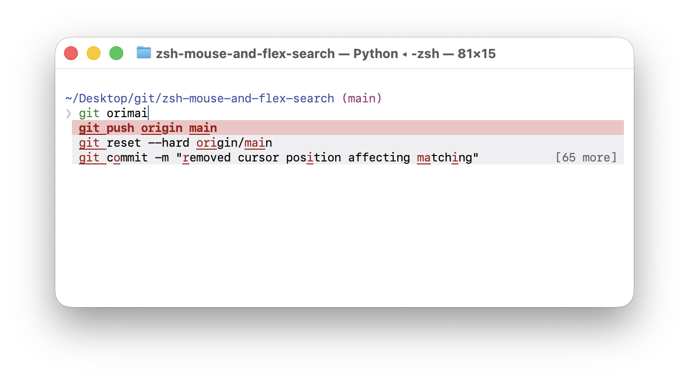

# zsh flex history search



A modernized terminal UI for searching zsh history with Emacs-style `flex` fuzzy matching, full mouse support for setting point and related interactions, and a Base16-driven color palette; in `.zshrc`, wire it via a `zle-line-init` hook (for example, `fh-line-init`) to run at prompt initialization.

## Run

```bash
./zsh_flex_history.py
```

Or:

```bash
python3 zsh_flex_history.py
```

## Behavior

- Loads history from `$HISTFILE` (or `~/.zsh_history`) on launch.
- Uses in-order flexible fuzzy matching (similar to Emacs `flex`).
- Shows a completing-read style vertical completion menu with highlighted match chars.
- Takes over mouse `x` from the native terminal app only when there is any text in the prompt.

## Keys

- `Up` / `Down` / Scroll: move selection
- `Tab`: inserts selected command
- `PageUp` / `PageDown`: move faster
- `Backspace`: delete query char
- `Enter`: print and optionally runs the selected command
- `Esc` or `Ctrl-C`: quit
